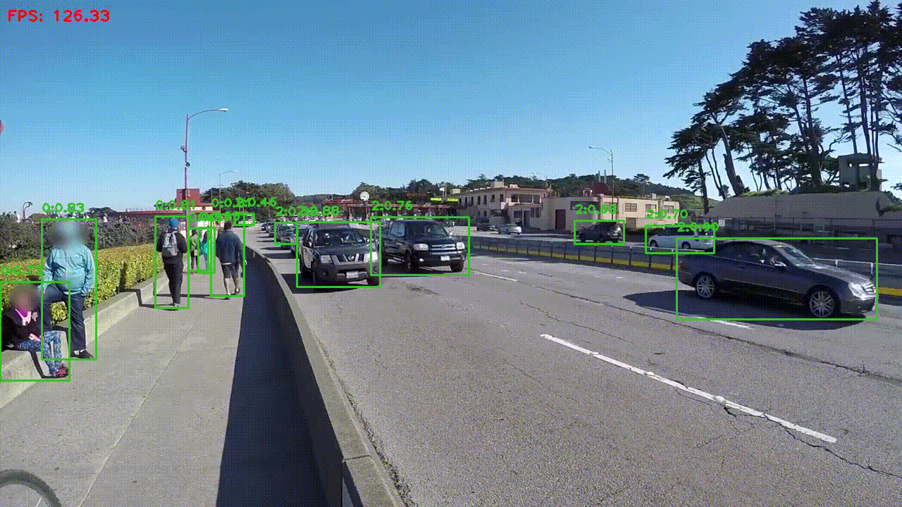

# YOLOv5-TRT Pybind11 Bindings 

<p align="center">
  
</p>

<h3 align="center">⚡ 超高性能 | 🐍 Python易用 | 🧠 TensorRT加速</h3>

这个项目提供了基于 `Pybind11` 的 `TensorRT YOLOv5` 插件 `Python` 绑定，实现了令人难以置信的**实时目标检测性能**！

- **⚡ 超100FPS性能**: 在 `Jetson Orin Nano` 上轻松实现超过 `120` 帧/秒的检测速度
- **🎯 高精度检测**: 基于成熟的 `YOLOv5` 架构，准确识别`COCO`数据集上的`80`类目标
- **🔌 即插即用**: 简单的 `Python` 接口，无需复杂的配置
- **🛠️ 工业级优化**: 采用 `TensorRT` 进行模型优化和加速

###  1. Building the plugin
```shell
sudo apt update
sudo apt install ffmpeg
sudo apt install pybind11-dev

cd yolov5_trt_pybind11
pip install pybind11
rm -fr build
cmake -S . -B build
cmake --build build
```

### 2. Model quantization
```shell
./media/gen_calib.sh
./build/build weights/yolov5s.onnx 1 ./media/ ./media/filelist.txt weights/yolov5s.engine
```
```
[11/06/2025-11:57:36] [I] [TRT] [MemUsageChange] Init CUDA: CPU +221, GPU +0, now: CPU 249, GPU 4229 (MiB)
[11/06/2025-11:57:39] [I] [TRT] [MemUsageChange] Init builder kernel library: CPU +302, GPU +277, now: CPU 574, GPU 4529 (MiB)
[11/06/2025-11:57:39] [I] [TRT] ----------------------------------------------------------------
[11/06/2025-11:57:39] [I] [TRT] Input filename:   weights/yolov5s.onnx
[11/06/2025-11:57:39] [I] [TRT] ONNX IR version:  0.0.7
[11/06/2025-11:57:39] [I] [TRT] Opset version:    12
[11/06/2025-11:57:39] [I] [TRT] Producer name:    
[11/06/2025-11:57:39] [I] [TRT] Producer version: 
[11/06/2025-11:57:39] [I] [TRT] Domain:           
[11/06/2025-11:57:39] [I] [TRT] Model version:    0
[11/06/2025-11:57:39] [I] [TRT] Doc string:       
[11/06/2025-11:57:39] [I] [TRT] ----------------------------------------------------------------
[11/06/2025-11:57:39] [I] [TRT] No importer registered for op: YoloLayer_TRT. Attempting to import as plugin.
[11/06/2025-11:57:39] [I] [TRT] Searching for plugin: YoloLayer_TRT, plugin_version: 1, plugin_namespace: 
[11/06/2025-11:57:39] [I] [TRT] Successfully created plugin: YoloLayer_TRT
[11/06/2025-11:57:39] [I] sample0001.png
[11/06/2025-11:57:39] [I] sample0002.png
[11/06/2025-11:57:39] [I] sample0003.png
[11/06/2025-11:57:39] [I] sample0004.png
[11/06/2025-11:57:39] [I] sample0005.png
[11/06/2025-11:57:39] [I] sample0006.png
[11/06/2025-11:57:39] [I] sample0007.png
[11/06/2025-11:57:39] [I] sample0008.png
[11/06/2025-11:57:39] [I] sample0009.png
[11/06/2025-11:57:39] [I] sample0010.png
[11/06/2025-11:57:39] [I] sample0011.png
[11/06/2025-11:57:39] [I] sample0012.png
[11/06/2025-11:57:39] [I] sample0013.png
[11/06/2025-11:57:39] [I] sample0014.png
[11/06/2025-11:57:39] [I] sample0015.png
[11/06/2025-11:57:39] [I] sample0016.png
[11/06/2025-11:57:39] [I] sample0017.png
[11/06/2025-11:57:39] [I] sample0018.png
[11/06/2025-11:57:39] [I] sample0019.png
[11/06/2025-11:57:39] [I] sample0020.png
[11/06/2025-11:57:39] [I] sample0021.png
[11/06/2025-11:57:39] [I] sample0022.png
[11/06/2025-11:57:39] [I] sample0023.png
[11/06/2025-11:57:39] [I] sample0024.png
[11/06/2025-11:57:39] [I] sample0025.png
[11/06/2025-11:57:39] [I] sample0026.png
[11/06/2025-11:57:39] [I] sample0027.png
[11/06/2025-11:57:39] [I] sample0028.png
[11/06/2025-11:57:39] [I] sample0029.png
[11/06/2025-11:57:39] [I] sample0030.png
[11/06/2025-11:57:39] [I] sample0031.png
[11/06/2025-11:57:39] [I] sample0032.png
[11/06/2025-11:57:39] [I] sample0033.png
[11/06/2025-11:57:39] [I] sample0034.png
[11/06/2025-11:57:39] [I] sample0035.png
[11/06/2025-11:57:39] [I] sample0036.png
[11/06/2025-11:57:39] [I] sample0037.png
[11/06/2025-11:57:39] [I] sample0038.png
[11/06/2025-11:57:39] [I] sample0039.png
[11/06/2025-11:57:39] [I] sample0040.png
[11/06/2025-11:57:39] [I] sample0041.png
[11/06/2025-11:57:39] [I] sample0042.png
[11/06/2025-11:57:39] [I] sample0043.png
[11/06/2025-11:57:39] [I] sample0044.png
[11/06/2025-11:57:39] [I] sample0045.png
[11/06/2025-11:57:39] [I] sample0046.png
[11/06/2025-11:57:39] [I] sample0047.png
[11/06/2025-11:57:39] [I] sample0048.png
[11/06/2025-11:57:39] [I] sample0049.png
[11/06/2025-11:57:39] [I] sample0050.png
[11/06/2025-11:57:39] [I] sample0051.png
[11/06/2025-11:57:39] [I] sample0052.png
[11/06/2025-11:57:39] [I] sample0053.png
[11/06/2025-11:57:39] [I] sample0054.png
[11/06/2025-11:57:39] [I] sample0055.png
[11/06/2025-11:57:39] [I] sample0056.png
[11/06/2025-11:57:39] [I] sample0057.png
[11/06/2025-11:57:39] [I] sample0058.png
[11/06/2025-11:57:39] [I] sample0059.png
[11/06/2025-11:57:39] [I] sample0060.png
[11/06/2025-11:57:39] [I] sample0061.png
[11/06/2025-11:57:39] [I] sample0062.png
[11/06/2025-11:57:39] [I] sample0063.png
[11/06/2025-11:57:39] [I] sample0064.png
[11/06/2025-11:57:39] [I] sample0065.png
[11/06/2025-11:57:39] [I] sample0066.png
[11/06/2025-11:57:39] [I] sample0067.png
[11/06/2025-11:57:39] [I] sample0068.png
[11/06/2025-11:57:39] [I] sample0069.png
[11/06/2025-11:57:39] [I] sample0070.png
[11/06/2025-11:57:39] [I] sample0071.png
[11/06/2025-11:57:39] [I] sample0072.png
[11/06/2025-11:57:39] [I] sample0073.png
[11/06/2025-11:57:39] [I] sample0074.png
[11/06/2025-11:57:39] [I] sample0075.png
[11/06/2025-11:57:39] [I] sample0076.png
[11/06/2025-11:57:39] [I] sample0077.png
[11/06/2025-11:57:39] [I] sample0078.png
[11/06/2025-11:57:39] [I] sample0079.png
[11/06/2025-11:57:39] [I] sample0080.png
[11/06/2025-11:57:39] [I] sample0081.png
[11/06/2025-11:57:39] [I] sample0082.png
[11/06/2025-11:57:39] [I] sample0083.png
[11/06/2025-11:57:39] [I] sample0084.png
[11/06/2025-11:57:39] [I] sample0085.png
[11/06/2025-11:57:39] [I] sample0086.png
[11/06/2025-11:57:39] [I] sample0087.png
[11/06/2025-11:57:39] [I] sample0088.png
[11/06/2025-11:57:39] [I] sample0089.png
[11/06/2025-11:57:39] [I] sample0090.png
[11/06/2025-11:57:39] [I] sample0091.png
[11/06/2025-11:57:39] [I] sample0092.png
[11/06/2025-11:57:39] [I] sample0093.png
[11/06/2025-11:57:39] [I] sample0094.png
[11/06/2025-11:57:39] [I] sample0095.png
[11/06/2025-11:57:39] [I] sample0096.png
[11/06/2025-11:57:39] [I] sample0097.png
[11/06/2025-11:57:39] [I] sample0098.png
[11/06/2025-11:57:39] [I] sample0099.png
[11/06/2025-11:57:39] [I] sample0100.png
[11/06/2025-11:57:39] [I] sample0101.png
[11/06/2025-11:57:39] [I] sample0102.png
[11/06/2025-11:57:39] [I] sample0103.png
[11/06/2025-11:57:39] [I] sample0104.png
[11/06/2025-11:57:39] [I] sample0105.png
[11/06/2025-11:57:39] [I] sample0106.png
[11/06/2025-11:57:39] [I] sample0107.png
[11/06/2025-11:57:39] [I] sample0108.png
[11/06/2025-11:57:39] [I] sample0109.png
[11/06/2025-11:57:39] [I] sample0110.png
[11/06/2025-11:57:39] [I] sample0111.png
[11/06/2025-11:57:39] [I] sample0112.png
[11/06/2025-11:57:39] [I] sample0113.png
[11/06/2025-11:57:39] [I] sample0114.png
[11/06/2025-11:57:39] [I] sample0115.png
[11/06/2025-11:57:39] [I] sample0116.png
[11/06/2025-11:57:39] [I] sample0117.png
[11/06/2025-11:57:39] [I] sample0118.png
[11/06/2025-11:57:39] [I] sample0119.png
[11/06/2025-11:57:39] [I] sample0120.png
[11/06/2025-11:57:39] [I] sample0121.png
[11/06/2025-11:57:39] [I] sample0122.png
[11/06/2025-11:57:39] [I] sample0123.png
[11/06/2025-11:57:39] [I] sample0124.png
[11/06/2025-11:57:39] [I] sample0125.png
[11/06/2025-11:57:39] [I] sample0126.png
[11/06/2025-11:57:39] [I] sample0127.png
[11/06/2025-11:57:39] [I] sample0128.png
[11/06/2025-11:57:39] [I] sample0129.png
[11/06/2025-11:57:39] [I] sample0130.png
[11/06/2025-11:57:39] [I] sample0131.png
[11/06/2025-11:57:39] [I] sample0132.png
[11/06/2025-11:57:39] [I] sample0133.png
[11/06/2025-11:57:39] [I] sample0134.png
[11/06/2025-11:57:39] [I] sample0135.png
[11/06/2025-11:57:39] [I] sample0136.png
[11/06/2025-11:57:39] [I] sample0137.png
[11/06/2025-11:57:39] [I] sample0138.png
[11/06/2025-11:57:39] [I] sample0139.png
[11/06/2025-11:57:39] [I] sample0140.png
[11/06/2025-11:57:39] [I] sample0141.png
[11/06/2025-11:57:39] [I] sample0142.png
[11/06/2025-11:57:39] [I] sample0143.png
[11/06/2025-11:57:39] [I] sample0144.png
[11/06/2025-11:57:39] [I] sample0145.png
CalibrationDataReader: 145 images, 145 batches.
[11/06/2025-11:57:39] [I] [TRT] Reading Calibration Cache for calibrator: MinMaxCalibration
[11/06/2025-11:57:39] [I] [TRT] Generated calibration scales using calibration cache. Make sure that calibration cache has latest scales.
[11/06/2025-11:57:39] [I] [TRT] To regenerate calibration cache, please delete the existing one. TensorRT will generate a new calibration cache.
[11/06/2025-11:57:39] [W] [TRT] Missing scale and zero-point for tensor DecodeNumDetection, expect fall back to non-int8 implementation for any layer consuming or producing given tensor
[11/06/2025-11:57:39] [W] [TRT] Missing scale and zero-point for tensor DecodeDetectionClasses, expect fall back to non-int8 implementation for any layer consuming or producing given tensor
[11/06/2025-11:57:39] [I] [TRT] ---------- Layers Running on DLA ----------
[11/06/2025-11:57:39] [I] [TRT] ---------- Layers Running on GPU ----------
[11/06/2025-11:57:39] [I] [TRT] [GpuLayer] CONVOLUTION: /model.0/conv/Conv + PWN(PWN(/model.0/act/Sigmoid), /model.0/act/Mul)
[11/06/2025-11:57:39] [I] [TRT] [GpuLayer] CONVOLUTION: /model.1/conv/Conv + PWN(PWN(/model.1/act/Sigmoid), /model.1/act/Mul)
[11/06/2025-11:57:39] [I] [TRT] [GpuLayer] CONVOLUTION: /model.2/cv1/conv/Conv + PWN(PWN(/model.2/cv1/act/Sigmoid), /model.2/cv1/act/Mul)
[11/06/2025-11:57:39] [I] [TRT] [GpuLayer] CONVOLUTION: /model.2/cv2/conv/Conv + PWN(PWN(/model.2/cv2/act/Sigmoid), /model.2/cv2/act/Mul)
[11/06/2025-11:57:39] [I] [TRT] [GpuLayer] CONVOLUTION: /model.2/m/m.0/cv1/conv/Conv + PWN(PWN(/model.2/m/m.0/cv1/act/Sigmoid), /model.2/m/m.0/cv1/act/Mul)
[11/06/2025-11:57:39] [I] [TRT] [GpuLayer] CONVOLUTION: /model.2/m/m.0/cv2/conv/Conv
[11/06/2025-11:57:39] [I] [TRT] [GpuLayer] POINTWISE: PWN(PWN(PWN(/model.2/m/m.0/cv2/act/Sigmoid), /model.2/m/m.0/cv2/act/Mul), /model.2/m/m.0/Add)
[11/06/2025-11:57:39] [I] [TRT] [GpuLayer] CONVOLUTION: /model.2/cv3/conv/Conv + PWN(PWN(/model.2/cv3/act/Sigmoid), /model.2/cv3/act/Mul)
[11/06/2025-11:57:39] [I] [TRT] [GpuLayer] CONVOLUTION: /model.3/conv/Conv + PWN(PWN(/model.3/act/Sigmoid), /model.3/act/Mul)
[11/06/2025-11:57:39] [I] [TRT] [GpuLayer] CONVOLUTION: /model.4/cv1/conv/Conv + PWN(PWN(/model.4/cv1/act/Sigmoid), /model.4/cv1/act/Mul)
[11/06/2025-11:57:39] [I] [TRT] [GpuLayer] CONVOLUTION: /model.4/cv2/conv/Conv + PWN(PWN(/model.4/cv2/act/Sigmoid), /model.4/cv2/act/Mul)
[11/06/2025-11:57:39] [I] [TRT] [GpuLayer] CONVOLUTION: /model.4/m/m.0/cv1/conv/Conv + PWN(PWN(/model.4/m/m.0/cv1/act/Sigmoid), /model.4/m/m.0/cv1/act/Mul)
[11/06/2025-11:57:39] [I] [TRT] [GpuLayer] CONVOLUTION: /model.4/m/m.0/cv2/conv/Conv
[11/06/2025-11:57:39] [I] [TRT] [GpuLayer] POINTWISE: PWN(PWN(PWN(/model.4/m/m.0/cv2/act/Sigmoid), /model.4/m/m.0/cv2/act/Mul), /model.4/m/m.0/Add)
[11/06/2025-11:57:39] [I] [TRT] [GpuLayer] CONVOLUTION: /model.4/m/m.1/cv1/conv/Conv + PWN(PWN(/model.4/m/m.1/cv1/act/Sigmoid), /model.4/m/m.1/cv1/act/Mul)
[11/06/2025-11:57:39] [I] [TRT] [GpuLayer] CONVOLUTION: /model.4/m/m.1/cv2/conv/Conv
[11/06/2025-11:57:39] [I] [TRT] [GpuLayer] POINTWISE: PWN(PWN(PWN(/model.4/m/m.1/cv2/act/Sigmoid), /model.4/m/m.1/cv2/act/Mul), /model.4/m/m.1/Add)
[11/06/2025-11:57:39] [I] [TRT] [GpuLayer] CONVOLUTION: /model.4/cv3/conv/Conv + PWN(PWN(/model.4/cv3/act/Sigmoid), /model.4/cv3/act/Mul)
[11/06/2025-11:57:39] [I] [TRT] [GpuLayer] CONVOLUTION: /model.5/conv/Conv + PWN(PWN(/model.5/act/Sigmoid), /model.5/act/Mul)
[11/06/2025-11:57:39] [I] [TRT] [GpuLayer] CONVOLUTION: /model.6/cv1/conv/Conv + PWN(PWN(/model.6/cv1/act/Sigmoid), /model.6/cv1/act/Mul)
[11/06/2025-11:57:39] [I] [TRT] [GpuLayer] CONVOLUTION: /model.6/cv2/conv/Conv + PWN(PWN(/model.6/cv2/act/Sigmoid), /model.6/cv2/act/Mul)
[11/06/2025-11:57:39] [I] [TRT] [GpuLayer] CONVOLUTION: /model.6/m/m.0/cv1/conv/Conv + PWN(PWN(/model.6/m/m.0/cv1/act/Sigmoid), /model.6/m/m.0/cv1/act/Mul)
[11/06/2025-11:57:39] [I] [TRT] [GpuLayer] CONVOLUTION: /model.6/m/m.0/cv2/conv/Conv
[11/06/2025-11:57:39] [I] [TRT] [GpuLayer] POINTWISE: PWN(PWN(PWN(/model.6/m/m.0/cv2/act/Sigmoid), /model.6/m/m.0/cv2/act/Mul), /model.6/m/m.0/Add)
[11/06/2025-11:57:39] [I] [TRT] [GpuLayer] CONVOLUTION: /model.6/m/m.1/cv1/conv/Conv + PWN(PWN(/model.6/m/m.1/cv1/act/Sigmoid), /model.6/m/m.1/cv1/act/Mul)
[11/06/2025-11:57:39] [I] [TRT] [GpuLayer] CONVOLUTION: /model.6/m/m.1/cv2/conv/Conv
[11/06/2025-11:57:39] [I] [TRT] [GpuLayer] POINTWISE: PWN(PWN(PWN(/model.6/m/m.1/cv2/act/Sigmoid), /model.6/m/m.1/cv2/act/Mul), /model.6/m/m.1/Add)
[11/06/2025-11:57:39] [I] [TRT] [GpuLayer] CONVOLUTION: /model.6/m/m.2/cv1/conv/Conv + PWN(PWN(/model.6/m/m.2/cv1/act/Sigmoid), /model.6/m/m.2/cv1/act/Mul)
[11/06/2025-11:57:39] [I] [TRT] [GpuLayer] CONVOLUTION: /model.6/m/m.2/cv2/conv/Conv
[11/06/2025-11:57:39] [I] [TRT] [GpuLayer] POINTWISE: PWN(PWN(PWN(/model.6/m/m.2/cv2/act/Sigmoid), /model.6/m/m.2/cv2/act/Mul), /model.6/m/m.2/Add)
[11/06/2025-11:57:39] [I] [TRT] [GpuLayer] CONVOLUTION: /model.6/cv3/conv/Conv + PWN(PWN(/model.6/cv3/act/Sigmoid), /model.6/cv3/act/Mul)
[11/06/2025-11:57:39] [I] [TRT] [GpuLayer] CONVOLUTION: /model.7/conv/Conv + PWN(PWN(/model.7/act/Sigmoid), /model.7/act/Mul)
[11/06/2025-11:57:39] [I] [TRT] [GpuLayer] CONVOLUTION: /model.8/cv1/conv/Conv + PWN(PWN(/model.8/cv1/act/Sigmoid), /model.8/cv1/act/Mul)
[11/06/2025-11:57:39] [I] [TRT] [GpuLayer] CONVOLUTION: /model.8/cv2/conv/Conv + PWN(PWN(/model.8/cv2/act/Sigmoid), /model.8/cv2/act/Mul)
[11/06/2025-11:57:39] [I] [TRT] [GpuLayer] CONVOLUTION: /model.8/m/m.0/cv1/conv/Conv + PWN(PWN(/model.8/m/m.0/cv1/act/Sigmoid), /model.8/m/m.0/cv1/act/Mul)
[11/06/2025-11:57:39] [I] [TRT] [GpuLayer] CONVOLUTION: /model.8/m/m.0/cv2/conv/Conv
[11/06/2025-11:57:39] [I] [TRT] [GpuLayer] POINTWISE: PWN(PWN(PWN(/model.8/m/m.0/cv2/act/Sigmoid), /model.8/m/m.0/cv2/act/Mul), /model.8/m/m.0/Add)
[11/06/2025-11:57:39] [I] [TRT] [GpuLayer] CONVOLUTION: /model.8/cv3/conv/Conv + PWN(PWN(/model.8/cv3/act/Sigmoid), /model.8/cv3/act/Mul)
[11/06/2025-11:57:39] [I] [TRT] [GpuLayer] CONVOLUTION: /model.9/cv1/conv/Conv + PWN(PWN(/model.9/cv1/act/Sigmoid), /model.9/cv1/act/Mul)
[11/06/2025-11:57:39] [I] [TRT] [GpuLayer] POOLING: /model.9/m/MaxPool
[11/06/2025-11:57:39] [I] [TRT] [GpuLayer] POOLING: /model.9/m_1/MaxPool
[11/06/2025-11:57:39] [I] [TRT] [GpuLayer] POOLING: /model.9/m_2/MaxPool
[11/06/2025-11:57:39] [I] [TRT] [GpuLayer] COPY: /model.9/cv1/act/Mul_output_0 copy
[11/06/2025-11:57:39] [I] [TRT] [GpuLayer] COPY: /model.9/m/MaxPool_output_0 copy
[11/06/2025-11:57:39] [I] [TRT] [GpuLayer] COPY: /model.9/m_1/MaxPool_output_0 copy
[11/06/2025-11:57:39] [I] [TRT] [GpuLayer] CONVOLUTION: /model.9/cv2/conv/Conv + PWN(PWN(/model.9/cv2/act/Sigmoid), /model.9/cv2/act/Mul)
[11/06/2025-11:57:39] [I] [TRT] [GpuLayer] CONVOLUTION: /model.10/conv/Conv + PWN(PWN(/model.10/act/Sigmoid), /model.10/act/Mul)
[11/06/2025-11:57:39] [I] [TRT] [GpuLayer] RESIZE: /model.11/Resize
[11/06/2025-11:57:39] [I] [TRT] [GpuLayer] COPY: /model.11/Resize_output_0 copy
[11/06/2025-11:57:39] [I] [TRT] [GpuLayer] CONVOLUTION: /model.13/cv1/conv/Conv + PWN(PWN(/model.13/cv1/act/Sigmoid), /model.13/cv1/act/Mul)
[11/06/2025-11:57:39] [I] [TRT] [GpuLayer] CONVOLUTION: /model.13/cv2/conv/Conv + PWN(PWN(/model.13/cv2/act/Sigmoid), /model.13/cv2/act/Mul)
[11/06/2025-11:57:39] [I] [TRT] [GpuLayer] CONVOLUTION: /model.13/m/m.0/cv1/conv/Conv + PWN(PWN(/model.13/m/m.0/cv1/act/Sigmoid), /model.13/m/m.0/cv1/act/Mul)
[11/06/2025-11:57:39] [I] [TRT] [GpuLayer] CONVOLUTION: /model.13/m/m.0/cv2/conv/Conv + PWN(PWN(/model.13/m/m.0/cv2/act/Sigmoid), /model.13/m/m.0/cv2/act/Mul)
[11/06/2025-11:57:39] [I] [TRT] [GpuLayer] CONVOLUTION: /model.13/cv3/conv/Conv + PWN(PWN(/model.13/cv3/act/Sigmoid), /model.13/cv3/act/Mul)
[11/06/2025-11:57:39] [I] [TRT] [GpuLayer] CONVOLUTION: /model.14/conv/Conv + PWN(PWN(/model.14/act/Sigmoid), /model.14/act/Mul)
[11/06/2025-11:57:39] [I] [TRT] [GpuLayer] RESIZE: /model.15/Resize
[11/06/2025-11:57:39] [I] [TRT] [GpuLayer] COPY: /model.15/Resize_output_0 copy
[11/06/2025-11:57:39] [I] [TRT] [GpuLayer] COPY: /model.4/cv3/act/Mul_output_0 copy
[11/06/2025-11:57:39] [I] [TRT] [GpuLayer] CONVOLUTION: /model.17/cv1/conv/Conv + PWN(PWN(/model.17/cv1/act/Sigmoid), /model.17/cv1/act/Mul)
[11/06/2025-11:57:39] [I] [TRT] [GpuLayer] CONVOLUTION: /model.17/cv2/conv/Conv + PWN(PWN(/model.17/cv2/act/Sigmoid), /model.17/cv2/act/Mul)
[11/06/2025-11:57:39] [I] [TRT] [GpuLayer] CONVOLUTION: /model.17/m/m.0/cv1/conv/Conv + PWN(PWN(/model.17/m/m.0/cv1/act/Sigmoid), /model.17/m/m.0/cv1/act/Mul)
[11/06/2025-11:57:39] [I] [TRT] [GpuLayer] CONVOLUTION: /model.17/m/m.0/cv2/conv/Conv + PWN(PWN(/model.17/m/m.0/cv2/act/Sigmoid), /model.17/m/m.0/cv2/act/Mul)
[11/06/2025-11:57:39] [I] [TRT] [GpuLayer] CONVOLUTION: /model.17/cv3/conv/Conv + PWN(PWN(/model.17/cv3/act/Sigmoid), /model.17/cv3/act/Mul)
[11/06/2025-11:57:39] [I] [TRT] [GpuLayer] CONVOLUTION: /model.18/conv/Conv + PWN(PWN(/model.18/act/Sigmoid), /model.18/act/Mul)
[11/06/2025-11:57:39] [I] [TRT] [GpuLayer] CONVOLUTION: /model.24/m.0/Conv + PWN(/model.24/Sigmoid)
[11/06/2025-11:57:39] [I] [TRT] [GpuLayer] COPY: /model.14/act/Mul_output_0 copy
[11/06/2025-11:57:39] [I] [TRT] [GpuLayer] CONVOLUTION: /model.20/cv1/conv/Conv + PWN(PWN(/model.20/cv1/act/Sigmoid), /model.20/cv1/act/Mul)
[11/06/2025-11:57:39] [I] [TRT] [GpuLayer] CONVOLUTION: /model.20/cv2/conv/Conv + PWN(PWN(/model.20/cv2/act/Sigmoid), /model.20/cv2/act/Mul)
[11/06/2025-11:57:39] [I] [TRT] [GpuLayer] CONVOLUTION: /model.20/m/m.0/cv1/conv/Conv + PWN(PWN(/model.20/m/m.0/cv1/act/Sigmoid), /model.20/m/m.0/cv1/act/Mul)
[11/06/2025-11:57:39] [I] [TRT] [GpuLayer] CONVOLUTION: /model.20/m/m.0/cv2/conv/Conv + PWN(PWN(/model.20/m/m.0/cv2/act/Sigmoid), /model.20/m/m.0/cv2/act/Mul)
[11/06/2025-11:57:39] [I] [TRT] [GpuLayer] CONVOLUTION: /model.20/cv3/conv/Conv + PWN(PWN(/model.20/cv3/act/Sigmoid), /model.20/cv3/act/Mul)
[11/06/2025-11:57:39] [I] [TRT] [GpuLayer] CONVOLUTION: /model.21/conv/Conv + PWN(PWN(/model.21/act/Sigmoid), /model.21/act/Mul)
[11/06/2025-11:57:39] [I] [TRT] [GpuLayer] CONVOLUTION: /model.24/m.1/Conv + PWN(/model.24/Sigmoid_1)
[11/06/2025-11:57:39] [I] [TRT] [GpuLayer] COPY: /model.10/act/Mul_output_0 copy
[11/06/2025-11:57:39] [I] [TRT] [GpuLayer] CONVOLUTION: /model.23/cv1/conv/Conv + PWN(PWN(/model.23/cv1/act/Sigmoid), /model.23/cv1/act/Mul)
[11/06/2025-11:57:39] [I] [TRT] [GpuLayer] CONVOLUTION: /model.23/cv2/conv/Conv + PWN(PWN(/model.23/cv2/act/Sigmoid), /model.23/cv2/act/Mul)
[11/06/2025-11:57:39] [I] [TRT] [GpuLayer] CONVOLUTION: /model.23/m/m.0/cv1/conv/Conv + PWN(PWN(/model.23/m/m.0/cv1/act/Sigmoid), /model.23/m/m.0/cv1/act/Mul)
[11/06/2025-11:57:39] [I] [TRT] [GpuLayer] CONVOLUTION: /model.23/m/m.0/cv2/conv/Conv + PWN(PWN(/model.23/m/m.0/cv2/act/Sigmoid), /model.23/m/m.0/cv2/act/Mul)
[11/06/2025-11:57:39] [I] [TRT] [GpuLayer] CONVOLUTION: /model.23/cv3/conv/Conv + PWN(PWN(/model.23/cv3/act/Sigmoid), /model.23/cv3/act/Mul)
[11/06/2025-11:57:39] [I] [TRT] [GpuLayer] CONVOLUTION: /model.24/m.2/Conv + PWN(/model.24/Sigmoid_2)
[11/06/2025-11:57:39] [I] [TRT] [GpuLayer] PLUGIN_V2: YoloLayer
[11/06/2025-11:57:40] [I] [TRT] [MemUsageChange] Init cuBLAS/cuBLASLt: CPU +534, GPU +689, now: CPU 1137, GPU 5200 (MiB)
[11/06/2025-11:57:41] [I] [TRT] [MemUsageChange] Init cuDNN: CPU +83, GPU +132, now: CPU 1220, GPU 5332 (MiB)
[11/06/2025-11:57:41] [I] [TRT] Local timing cache in use. Profiling results in this builder pass will not be stored.
[11/06/2025-12:00:45] [I] [TRT] Some tactics do not have sufficient workspace memory to run. Increasing workspace size will enable more tactics, please check verbose output for requested sizes.
[11/06/2025-12:01:03] [I] [TRT] Total Activation Memory: 1115794944
[11/06/2025-12:01:03] [I] [TRT] Detected 1 inputs and 4 output network tensors.
[11/06/2025-12:01:03] [I] [TRT] Total Host Persistent Memory: 175984
[11/06/2025-12:01:03] [I] [TRT] Total Device Persistent Memory: 614912
[11/06/2025-12:01:03] [I] [TRT] Total Scratch Memory: 0
[11/06/2025-12:01:03] [I] [TRT] [MemUsageStats] Peak memory usage of TRT CPU/GPU memory allocators: CPU 7 MiB, GPU 553 MiB
[11/06/2025-12:01:03] [I] [TRT] [BlockAssignment] Started assigning block shifts. This will take 67 steps to complete.
[11/06/2025-12:01:03] [I] [TRT] [BlockAssignment] Algorithm ShiftNTopDown took 2.77161ms to assign 6 blocks to 67 nodes requiring 10925056 bytes.
[11/06/2025-12:01:03] [I] [TRT] Total Activation Memory: 10925056
[11/06/2025-12:01:04] [I] [TRT] [MemUsageChange] Init cuBLAS/cuBLASLt: CPU +0, GPU +0, now: CPU 1557, GPU 5945 (MiB)
[11/06/2025-12:01:04] [I] [TRT] [MemUsageChange] Init cuDNN: CPU +0, GPU +0, now: CPU 1557, GPU 5945 (MiB)
[11/06/2025-12:01:04] [I] [TRT] [MemUsageChange] TensorRT-managed allocation in building engine: CPU +7, GPU +8, now: CPU 7, GPU 8 (MiB)
Engine build success!
```

### Python call example
```shell
python yolov5_infer.py
```
```shell
[11/06/2025-15:23:26] [I] [TRT] Loaded engine size: 7 MiB
Deserialize yoloLayer plugin: YoloLayer
[11/06/2025-15:23:28] [I] [TRT] [MemUsageChange] Init cuBLAS/cuBLASLt: CPU +536, GPU +955, now: CPU 830, GPU 4470 (MiB)
[11/06/2025-15:23:28] [I] [TRT] [MemUsageChange] Init cuDNN: CPU +83, GPU +149, now: CPU 913, GPU 4619 (MiB)
[11/06/2025-15:23:28] [I] [TRT] [MemUsageChange] TensorRT-managed allocation in engine deserialization: CPU +0, GPU +7, now: CPU 0, GPU 7 (MiB)
[11/06/2025-15:23:28] [I] [TRT] [MemUsageChange] Init cuBLAS/cuBLASLt: CPU +0, GPU +0, now: CPU 913, GPU 4620 (MiB)
[11/06/2025-15:23:28] [I] [TRT] [MemUsageChange] Init cuDNN: CPU +0, GPU +3, now: CPU 913, GPU 4623 (MiB)
[11/06/2025-15:23:28] [I] [TRT] [MemUsageChange] TensorRT-managed allocation in IExecutionContext creation: CPU +0, GPU +11, now: CPU 0, GPU 18 (MiB)
Processed 1442 frames
Average FPS: 127.51
Min FPS: 75.75
Max FPS: 134.67
```
